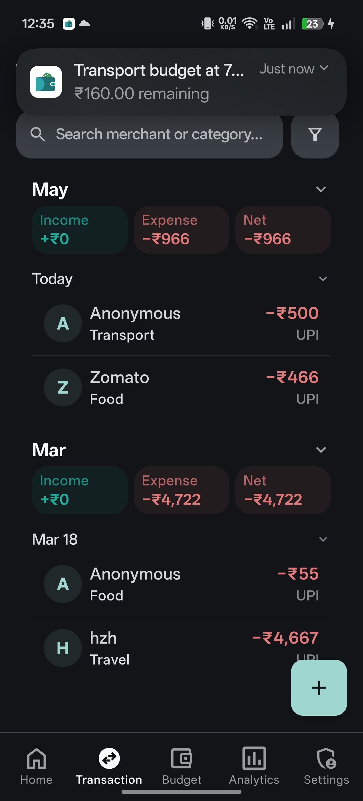
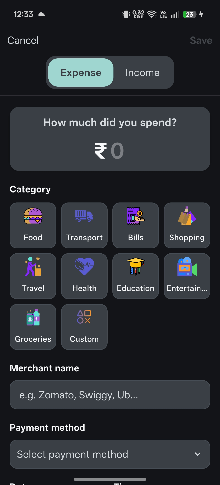
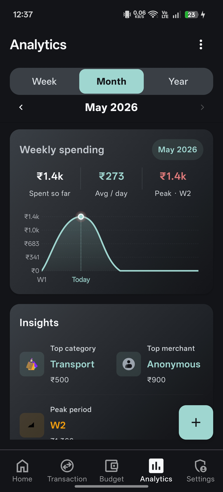
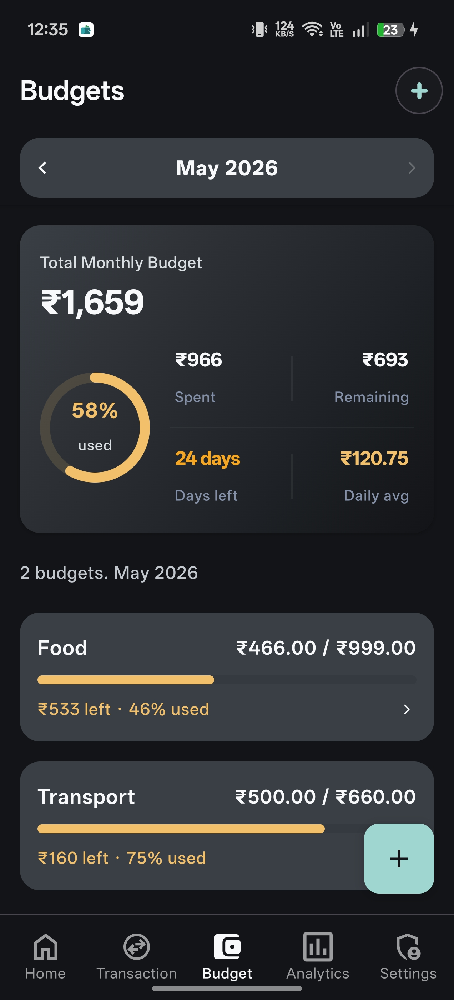
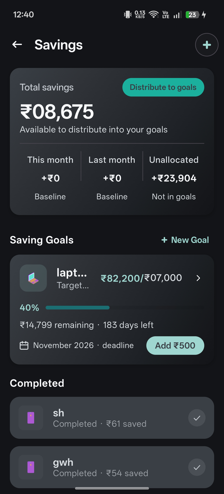
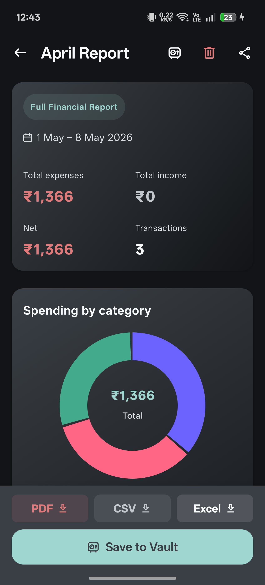
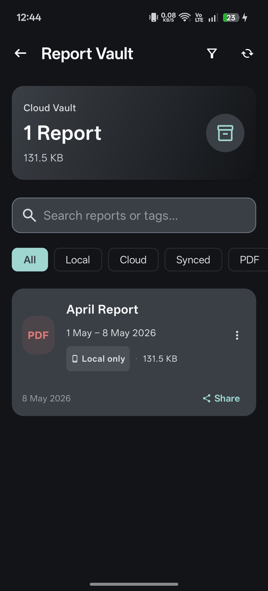
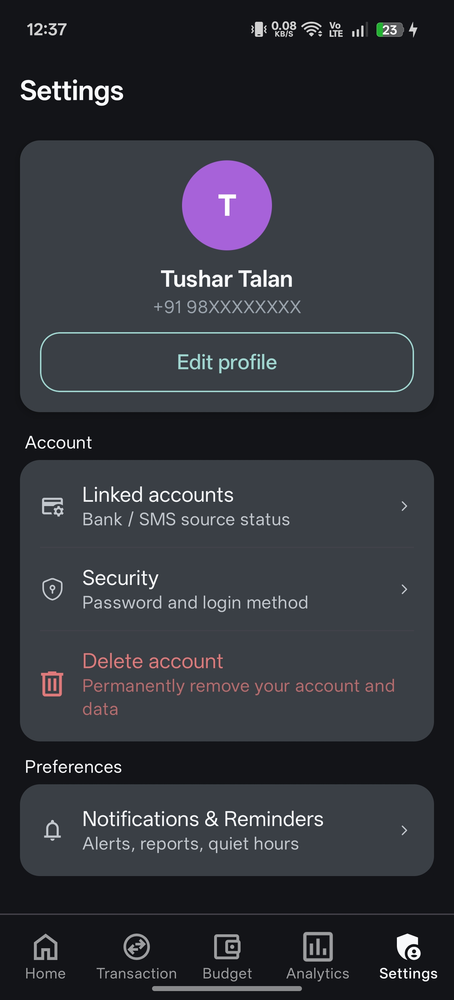

# 📊 TruXpense

[](https://kotlinlang.org/)
[](https://developer.android.com/jetpack/compose)
[](https://m3.material.io/)
[](https://www.android.com/)

**TruXpense** is a sophisticated, AI-powered personal finance manager for Android. It goes beyond simple expense tracking by automatically parsing bank SMS, categorizing transactions, and providing actionable insights through a premium, Material 3-driven user interface.

---

## 📸 Premium Showcase (Curated Feature Clusters)

A streamlined 6-step journey through the TruXpense ecosystem, highlighting the synergy between automated tracking and professional analysis.

| 1. Core Experience | 2. Manual Data Entry | 3. Visual Analytics |
| :---: | :---: | :---: |
|   |  |   |
| *Dashboard & History* | *Manual Transaction Entry* | *Spending Trends & Charts* |

| 4. Financial Planning | 5. Professional Reporting | 6. App Customization |
| :---: | :---: | :---: |
|   |   |   |
| *Budgets & Savings Goals* | *Analysis & Vault* | *Preferences & Notifications* |

### 🌗 Dynamic Theme Support
*Seamlessly transition between Light and Dark modes with Material You dynamic color scaling.*

| Light Mode | Dark Mode |
| :---: | :---: |
|  |  |

---

## 🌟 Key Features

- **🤖 AI-Powered Automation**: Automatically detects and parses bank SMS notifications to record transactions in real-time.
- **📈 Advanced Analytics**: Visualize your spending habits with dynamic charts, category breakdowns, and daily spending trends.
- **💰 Smart Budgeting**: Set monthly budgets for specific categories and get notified as you approach your limits.
- **🎯 Savings Goals**: Create and track multiple savings goals with a dedicated distribution system.
- **📄 Professional Reports**: Generate detailed expense reports (PDF/Image) with visual charts, ready for sharing or record-keeping.
- **🔒 Report Vault**: A secure space to manage and view all your historical financial reports.
- **🌗 Full Theme Support**: Beautifully crafted Light and Dark modes that adapt to your system preferences.
- **🔔 Smart Reminders**: Customizable notifications to keep you on track with your financial goals.

---

## 🛠️ Tech Stack

- **Language**: Kotlin
- **UI Framework**: Jetpack Compose (Modern Declarative UI)
- **Design System**: Material Design 3 (M3)
- **Architecture**: MVVM (Model-View-ViewModel)
- **Local Database**: Room Persistence Library
- **SMS Parsing**: Android SMS API + Custom Regex/AI logic
- **Charts**: MPAndroidChart / Compose Charts
- **Dependency Injection**: Hilt / Dagger
- **Background Tasks**: WorkManager

---

## 🚀 Getting Started

### Prerequisites
- Android Studio Ladybug (or later)
- Android SDK 24+
- A physical device or emulator with SMS capabilities (for testing auto-parsing)

### Installation
1. Clone the repository:
   ```bash
   git clone https://github.com/TarunTalan/TruXpense-app.git
   ```
2. Open the project in Android Studio.
3. Sync the Gradle files.
4. Run the app on your device/emulator.

---

## 🤝 Contributing

Contributions are what make the open-source community such an amazing place to learn, inspire, and create. Any contributions you make are **greatly appreciated**.

1. Fork the Project
2. Create your Feature Branch (`git checkout -b feature/AmazingFeature`)
3. Commit your Changes (`git commit -m 'Add some AmazingFeature'`)
4. Push to the Branch (`git push origin feature/AmazingFeature`)
5. Open a Pull Request

---

## 📧 Contact

**Tarun Talan** - [LinkedIn](https://www.linkedin.com/in/tarun-talan-77360a37a/) - [Portfolio](https://www.tarundev.me/project)

Project Link: [https://github.com/TarunTalan/TruXpense-app](https://github.com/TarunTalan/TruXpense-app)

---
*Developed with ❤️ by Tarun Talan*
